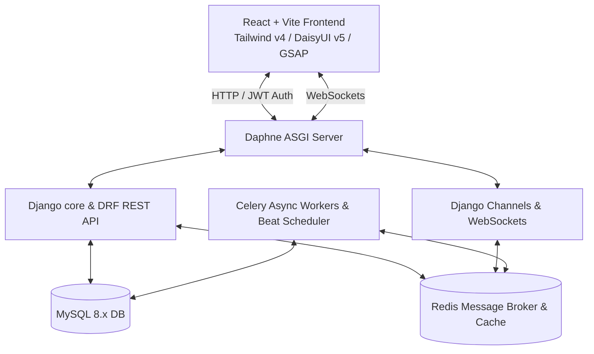

# Operations Management System (OMS) — System Guide & Showcase Manual

Welcome to the Operations Management System (OMS) Technical Reference & Showcase Manual. This guide provides a complete breakdown of how the application is built, where the key codebase elements are located, how the modules interact, and a detailed showcase script to demonstrate the system during reviews or presentations.

---

## Table of Contents
1. [System Overview](#1-system-overview)
2. [High-Level Architecture](#2-high-level-architecture)
3. [Row-Level Multi-Tenancy (How Scoping Works)](#3-row-level-multi-tenancy-how-scoping-works)
4. [Database Schema & Data Models](#4-database-schema--data-models)
5. [Core Modules & FSM Workflows](#5-core-modules--fsm-workflows)
   - 5.1 [Petty Cash Requisition Module](#51-petty-cash-requisition-module)
   - 5.2 [Leave Management Module](#52-leave-management-module)
   - 5.3 [Out-of-Office (OOO) Approval Delegation](#53-out-of-office-ooo-approval-delegation)
   - 5.4 [Recent Activity & Audit logs](#54-recent-activity--audit-logs)
   - 5.5 [Real-Time Notifications](#55-real-time-notifications)
6. [Codebase Directory Map (Where is What)](#6-codebase-directory-map-where-is-what)
7. [Step-by-Step Showcase Script (Demonstration Guide)](#7-step-by-step-showcase-script-demonstration-guide)

---

## 1. System Overview

OMS is a unified **multi-tenant Operations Management System** designed for three sister companies operating under a single parent organization:
1. **A Maze Venture** (Tenant slug: `amaze`)
2. **mYnt Connect** (Tenant slug: `mynt`)
3. **Braincount** (Tenant slug: `braincount`)

The system isolates all corporate transactions, budget controls, team records, and leave requests per organization while providing custom-tailored frontend branding (custom themes, colors, and layout tokens) dynamically matching the logged-in user's company.

---

## 2. High-Level Architecture

The system utilizes a modern, decoupled stack built to scale:



*   **Backend REST API**: Python 3.11+, Django 5.x, and Django REST Framework (DRF) 3.15+.
*   **State Machine Engine**: Enforced on the database models using `django-fsm-2` (Finite State Machine).
*   **Asynchronous Communication**: WebSockets using Django Channels and Daphne ASGI server for real-time notification push.
*   **Background Jobs**: Celery task runner backed by a Redis message broker.
*   **Database Engine**: MySQL 8.x (stores relational data, file BLOB receipts, audit logs, and configurations).
*   **Frontend Client**: React 19 + Vite 6 runtime. State managed via Zustand 5 and TanStack Query (React Query) v5.
*   **Styles & Animations**: Styled using Tailwind CSS v4, DaisyUI v5 components, and animated via GSAP & Framer Motion.

---

## 3. Row-Level Multi-Tenancy (How Scoping Works)

OMS implements **shared-schema multi-tenancy**. All tenants share the same MySQL database instance and tables, but data is rigidly partitioned at the row level using the `organization` foreign key. Row-level isolation is achieved through three security layers:

```
[REST Request] ──► [Layer 1: OrganizationMiddleware] ──► Manually decodes JWT token, attaches
                                                         `request.organization` dynamically, and 
                                                         stores it in thread-local storage.
                                                                    │
                                                                    ▼
                   [Layer 2: OrganizationViewSetMixin] ──► Overrides view set get_queryset() to
                                                         auto-filter rows: `.filter(organization=org)`.
                                                                    │
                                                                    ▼
                   [Layer 3: IsOrganizationMember]     ──► Object-level permission guard verifying
                                                         that the accessed record's organization
                                                         strictly matches the requester's organization.
```

### Layer 1: Middleware Scoping (`core/middleware.py`)
Because SimpleJWT authentication executes at the Django REST Framework view layer, the custom `OrganizationMiddleware` manually intercepts the HTTP request header:
1. Reads `Authorization: Bearer <token>`.
2. Decodes the token to identify the user and retrieve their corresponding company profile.
3. Attaches `request.organization` as a lazy property to the HTTP request.
4. Stores the authenticated user and request context in **Thread Local Storage** (`core/thread_local.py`) to scope queries during that thread's lifecycle, clearing it upon response/exception to prevent memory leaks.

### Layer 2: Automatic Query Scoping (`core/mixins.py`)
All tenant-scoped endpoints inherit from `OrganizationViewSetMixin`. This mixin overrides `get_queryset()` to automatically apply `queryset.filter(organization=request.organization)`. 
*   **Superpower Exception**: Users with the `ADMIN` role bypass this scoping and can view all data or filter by specifying an organization ID in the query params (`?org=<id>`).

### Layer 3: Object-Level Scopes (`core/permissions.py`)
The `IsOrganizationMember` permission guard verifies ownership at the individual object lookup level. If a user attempts to fetch or edit a resource ID directly (e.g., `/api/petty-cash/99/`), the guard verifies:
`obj.organization == request.user.profile.organization`. If they do not match, it blocks access with a `403 Forbidden` error (or `404 Not Found` for lists).

---

## 4. Database Schema & Data Models

Relational data structures are managed inside the backend under individual apps. Key models include:

### 1. `core` App Models
*   **`Organization`**: Tenant entity. Stores company name, slug (`amaze`, `mynt`, `braincount`), custom theme flags, and config parameters (e.g., policy JSON).
*   **`Department`**: Organizational scope (e.g., Engineering, Marketing, Finance). Stores monthly budgets, spent limits, and Team Lead approval limits.
*   **`ApprovalDelegation`**: Out-of-Office delegation record. Maps a delegator, delegate, scope (`PETTY_CASH`, `LEAVE`, `ALL`), and date range.
*   **`AuditLog`**: Logs all state transitions and system modifications. Records actor, action, target entity type, state change details (`old_state` to `new_state`), notes, and metadata.
*   **`Notification`**: Stores database alert records (recipient, notification type, title, message, action URL, read status).

### 2. `accounts` App Models
*   **`UserProfile`**: Extension of the Django `User` model. Contains the foreign keys to the user's `Organization` and `Department`, as well as their system `role` (`EMPLOYEE`, `TEAM_LEAD`, `GENERAL_MANAGER`, `HR`, `CEO`, `ADMIN`).

### 3. `pettycash` App Models
*   **`PettyCashRequest`**: Core transaction model. Includes amount requested, amount approved, amount disbursed, state, priority, needed by date, and approval notes.
*   **`PettyCashLineItem`**: Breakdown details for a specific request (description, quantity, unit price, category).
*   **`Attachment`**: Stores uploaded receipt images/documents. Stored as raw binary (`file_data`) inside the database (BLOB) to keep the backend infrastructure self-contained and simplify deployment.
*   **`Disbursement`**: Records individual payment actions. Tracks amount paid, payment method (`CASH`, `BANK_TRANSFER`, `CHEQUE`), reference numbers, and notes.

### 4. `leave` App Models
*   **`LeaveType`**: Defines types of absences (e.g., Annual, Sick, Casual). Configured with annual day limits, negative balance permissions, and document requirements.
*   **`LeaveBalance`**: Tracks available, used, and pending days per user, leave type, and calendar year.
*   **`LeaveRequest`**: Maps the requested dates (`start_date`, `end_date`), duration, coverage colleague (`delegate_to`), and approval states.
*   **`CompanyHoliday`**: Stores company-defined holidays to exclude them from the leave duration calculation.

---

## 5. Core Modules & Business Logic

### 5.1 Petty Cash Requisition Module
Enforces strict budget constraints and approval routes based on limits configured per department:

```
[Employee] ──► Submits Request ──► [Remaining Budget Check]
                                           │
                                           ▼
                                [Pending TL Approval]
                                           │
                                           ├─► Reject (To Draft)
                                           └─► Approve ──► [Amount > TL Limit?]
                                                                 │
                  ┌──────────────────────────────────────────────┴──────────────┐
                  ▼ YES                                                         ▼ NO
        [Pending CEO Approval]                                         [Pending HR Disbursement]
                  │                                                             │
                  ├─► Reject (To CEO Rejected)                                  ├─► Disburse Partial
                  └─► Approve                                                   │   (State: Partially Disbursed)
                          │                                                     │
                          ▼                                                     ▼
              [Pending HR Disbursement] ◄───────────────────────────────────────┴─► Disburse Full
                                                                                    (State: Disbursed)
```

1.  **Submission Budget Check**: When an employee submits a draft request, the system verifies:
    `amount_requested <= (monthly_budget - budget_spent_this_month)`. If the request exceeds the remaining budget, submission is blocked.
2.  **State Machine Routing**:
    *   **Under Team Lead Limit**: If the approved amount is below the department's `tl_approval_limit`, the Team Lead's approval routes the request directly to `pending_hr_disbursement`.
    *   **Over Team Lead Limit**: If the amount exceeds the limit, the request is escalated to `pending_ceo_approval`.
3.  **Superpower CEO Actions**: The CEO has authorization to execute a `ceo_direct_approve` directly bypassing the Team Lead stage.
4.  **Disbursement Lifecycle**: The HR user executes payments. The system supports **Partial Disbursements** (marking the request as `partially_disbursed` and updating `amount_disbursed`). Once the fully approved amount is paid, the state transitions to `disbursed`.
5.  **Budget Deduction**: On disbursement, the department's `budget_spent_this_month` is updated to reflect the paid amount.

### 5.2 Leave Management Module
Calculates durations and applies company absence policies:

```
[Employee] ──► Submits Leave ──► [Validation: Overlaps / Balance / Attachments]
                                            │
                                            ▼
                                  [Pending TL Approval]
                                            │
                                            ├─► Reject
                                            └─► Approve
                                                    │
                                                    ▼
                                          [Pending GM Approval]
                                                    │
                                                    ├─► Reject
                                                    └─► Approve
                                                            │
                                                            ▼
                                                        [Approved]
```

1.  **Working Days Calculation**: Calculates the duration using `calculate_working_days()`. It automatically:
    *   Excludes Bangladesh standard weekends (Fridays and Saturdays).
    *   Excludes official Bangladesh public holidays.
    *   Excludes custom tenant-specific `CompanyHoliday` records.
2.  **Validation Controls**:
    *   **Overlap Guard**: Prevents submission if there are overlapping leave requests.
    *   **Negative Balance Guard**: Checks if the user has sufficient balance. If the request exceeds the balance, it is blocked unless the specific `LeaveType` or organization configuration allows negative balances.
    *   **Attachments**: Sick leave exceeding a configured number of days requires an attachment.
3.  **Approval Routing**: Leave requests require **double approval**: first by the department **Team Lead**, and then by the **General Manager (GM)**. The CEO can bypass this routing using a direct approval override.
4.  **Balance Reservation**: Submitting a request moves the days from `available` to `pending` in the user's `LeaveBalance`. Rejecting or cancelling the request returns the days to `available`, while approval transfers them to `used`.

### 5.3 Out-of-Office (OOO) Approval Delegation
Allows supervisors (Team Leads, GMs, CEOs) to delegate approval authority to a colleague before going out of office:
*   The delegator creates a record designating a `delegate`, `scope` (`PETTY_CASH`, `LEAVE`, or `ALL`), and a date range.
*   While active, the delegate gains access to the delegator's approval endpoints. When listing requests, the delegate's approval center displays requests pending the delegator's approval.
*   All approval actions taken by a delegate are flagged in the `AuditLog` metadata (e.g., `"acted_as_delegate": true`, `"delegator_id": 3`).

### 5.4 Recent Activity & Audit Logs
A centralized audit logging system tracks status changes, field updates, and comments on all requests:
*   **Role Scoping**: Access to the `/api/audit-logs/` feed is restricted by role:
    *   `CEO`, `GM`, and `ADMIN` can view all audit logs within their tenant organization.
    *   `TEAM_LEAD` can view audit logs for requests originating from their department.
    *   Regular `EMPLOYEE` accounts cannot access the audit logs.

### 5.5 Real-Time Notifications
When request states transition (e.g., submitted, approved, rejected, disbursed), the backend triggers a broadcast via Django Channels.
*   **WebSockets**: Daphne routes the WebSocket requests to the `DashboardConsumer`. The consumer places authenticated clients in a personal user channel (`user_<id>`) and a tenant organization channel (`org_<slug>`).
*   **Dynamic UI updates**: Upon receiving a WebSocket event, the React frontend updates badge counts and shows real-time toast alerts.

---

## 6. Codebase Directory Map (Where is What)

Use this mapping to navigate the codebase:

### Backend Workspace (`oms_backend/`)
*   [manage.py](file:///f:/Work%20Stuff/A%20Maze/PettyCash/PettyCash/oms_backend/manage.py): Entrypoint command-line utility.
*   [oms_project/](file:///f:/Work%20Stuff/A%20Maze/PettyCash/PettyCash/oms_backend/oms_project/): System core.
    *   [settings/base.py](file:///f:/Work%20Stuff/A%20Maze/PettyCash/PettyCash/oms_backend/oms_project/settings/base.py): Base settings.
    *   [settings/development.py](file:///f:/Work%20Stuff/A%20Maze/PettyCash/PettyCash/oms_backend/oms_project/settings/development.py): Local development settings (MySQL & Redis configuration).
    *   [urls.py](file:///f:/Work%20Stuff/A%20Maze/PettyCash/PettyCash/oms_backend/oms_project/urls.py): Root URL routing configurations.
    *   [asgi.py](file:///f:/Work%20Stuff/A%20Maze/PettyCash/PettyCash/oms_backend/oms_project/asgi.py): Daphne ASGI protocol router.
    *   [celery.py](file:///f:/Work%20Stuff/A%20Maze/PettyCash/PettyCash/oms_backend/oms_project/celery.py): Celery async task framework configuration.
*   [core/](file:///f:/Work%20Stuff/A%20Maze/PettyCash/PettyCash/oms_backend/core/): Shared framework utilities.
    *   [models.py](file:///f:/Work%20Stuff/A%20Maze/PettyCash/PettyCash/oms_backend/core/models.py): Defines `Organization`, `Department`, `ApprovalDelegation`, `AuditLog`, `Notification`.
    *   [middleware.py](file:///f:/Work%20Stuff/A%20Maze/PettyCash/PettyCash/oms_backend/core/middleware.py): Row-level multi-tenancy extraction and context injection.
    *   [mixins.py](file:///f:/Work%20Stuff/A%20Maze/PettyCash/PettyCash/oms_backend/core/mixins.py): Automated tenant filtering for ViewSets.
    *   [permissions.py](file:///f:/Work%20Stuff/A%20Maze/PettyCash/PettyCash/oms_backend/core/permissions.py): Tenancy validation rules.
    *   [consumers.py](file:///f:/Work%20Stuff/A%20Maze/PettyCash/PettyCash/oms_backend/core/consumers.py): WebSocket protocol handler.
    *   [ws_auth.py](file:///f:/Work%20Stuff/A%20Maze/PettyCash/PettyCash/oms_backend/core/ws_auth.py): JWT decoding layer for WebSockets.
    *   [management/commands/seed_data.py](file:///f:/Work%20Stuff/A%20Maze/PettyCash/PettyCash/oms_backend/core/management/commands/seed_data.py): Command to seed demo tenants, budgets, users, and requests.
*   [accounts/](file:///f:/Work%20Stuff/A%20Maze/PettyCash/PettyCash/oms_backend/accounts/): Profiles & authentication.
    *   [models.py](file:///f:/Work%20Stuff/A%20Maze/PettyCash/PettyCash/oms_backend/accounts/models.py): Defines roles (`UserRole`) and `UserProfile`.
    *   [serializers.py](file:///f:/Work%20Stuff/A%20Maze/PettyCash/PettyCash/oms_backend/accounts/serializers.py): JWT token customizer and profile serializers.
*   [pettycash/](file:///f:/Work%20Stuff/A%20Maze/PettyCash/PettyCash/oms_backend/pettycash/): Expense tracking.
    *   [models.py](file:///f:/Work%20Stuff/A%20Maze/PettyCash/PettyCash/oms_backend/pettycash/models.py): Core request FSM logic, line items, and attachments.
    *   [views.py](file:///f:/Work%20Stuff/A%20Maze/PettyCash/PettyCash/oms_backend/pettycash/views.py): Approval and disbursement actions.
*   [leave/](file:///f:/Work%20Stuff/A%20Maze/PettyCash/PettyCash/oms_backend/leave/): Absences module.
    *   [models.py](file:///f:/Work%20Stuff/A%20Maze/PettyCash/PettyCash/oms_backend/leave/models.py): FSM workflows, balances, and holidays.
    *   [utils.py](file:///f:/Work%20Stuff/A%20Maze/PettyCash/PettyCash/oms_backend/leave/utils.py): Working day calculator, holiday exclusions, balance checks.

### Frontend Workspace (`oms_frontend/`)
*   [src/app/](file:///f:/Work%20Stuff/A%20Maze/PettyCash/PettyCash/oms_frontend/src/app/): App bootstrap.
    *   [router.jsx](file:///f:/Work%20Stuff/A%20Maze/PettyCash/PettyCash/oms_frontend/src/app/router.jsx): Router definitions and role route guards.
    *   [providers/ThemeProvider.jsx](file:///f:/Work%20Stuff/A%20Maze/PettyCash/PettyCash/oms_frontend/src/app/providers/ThemeProvider.jsx): Sets the `data-theme` attribute on user login.
*   [src/shared/](file:///f:/Work%20Stuff/A%20Maze/PettyCash/PettyCash/oms_frontend/src/shared/): Global layouts, components, and hooks.
    *   [components/layout/Sidebar.jsx](file:///f:/Work%20Stuff/A%20Maze/PettyCash/PettyCash/oms_frontend/src/shared/components/layout/Sidebar.jsx): Main navigation sidebar. Filters pending counts based on user role.
    *   [lib/axios.js](file:///f:/Work%20Stuff/A%20Maze/PettyCash/PettyCash/oms_frontend/src/shared/lib/axios.js): Global Axios instance with interceptors for JWT token injection and refresh.
    *   [stores/themeStore.js](file:///f:/Work%20Stuff/A%20Maze/PettyCash/PettyCash/oms_frontend/src/shared/stores/themeStore.js): Dark mode toggle state.
*   [src/features/](file:///f:/Work%20Stuff/A%20Maze/PettyCash/PettyCash/oms_frontend/src/features/): Business modules.
    *   `auth/stores/authStore.js`: Zustand store for user profiles and login state.
    *   `dashboard/pages/DashboardPage.jsx`: Main metrics panel and role-based recent activity log feed.
    *   `petty-cash/pages/PettyCashDetailPage.jsx`: Renders the FSM approval progress pipeline and details.
    *   `leave/pages/LeaveDetailPage.jsx`: Renders the leave status pipeline and details.
    *   `approvals/pages/ApprovalCenterPage.jsx`: Renders pending request list and approvals queue.
    *   `delegation/pages/DelegationPage.jsx`: Interface for configuring Out-of-Office delegations.
    *   `analytics/pages/`: Renders Recharts budget burn rate graphs and spending trends.

---

## 7. Step-by-Step Showcase Script (Demonstration Guide)

Use this script to demonstrate the system's core capabilities:

### Preparation: Spin Up Services
Ensure services are running in your terminal:
1.  **MySQL & Redis (WSL)**:
    ```bash
    wsl -u root service mysql start
    wsl -u root service redis-server start
    ```
2.  **Django API Daphne ASGI Server**:
    ```bash
    cd oms_backend
    .\venv_win\Scripts\daphne -b 127.0.0.1 -p 8000 oms_project.asgi:application
    ```
3.  **Celery Worker**:
    ```bash
    .\venv_win\Scripts\celery -A oms_project worker --loglevel=info --pool=solo
    ```
4.  **Vite Dev Server**:
    ```bash
    cd oms_frontend
    npm run dev
    ```

---

### Step 1: Multi-Tenancy & Dynamic Themes
*   **Action**: Open `http://localhost:5173`. Log in using A Maze Venture credentials:
    *   **Username**: `amaze_eng_emp1` | **Password**: `password123`
*   **Observation**: Point out the minimalist dark charcoal theme.
*   **Action**: Log out and log in using mYnt Connect credentials:
    *   **Username**: `mynt_mkt_emp1` | **Password**: `password123`
*   **Observation**: The site theme dynamically changes to a mint green color palette.
*   **Action**: Log out and log in using Braincount credentials:
    *   **Username**: `braincount_fin_emp1` | **Password**: `password123`
*   **Observation**: The site theme dynamically changes to a navy/magenta theme.
*   **Key Concept**: This demonstrates row-level data isolation and tenant custom styling matching the logged-in user's organization.

---

### Step 2: Petty Cash Budget Verification
*   **Action**: While logged in as `amaze_eng_emp1`, navigate to **Petty Cash** and click **New Request**.
*   **Action**: Attempt to submit a request for an amount that exceeds the department's remaining budget (e.g., `৳200,000` when budget is `৳100,000`).
*   **Observation**: The system displays a validation error blocking the submission.
*   **Action**: Enter a valid amount (e.g., `৳30,000`, which exceeds the Team Lead's limit of `৳25,000` but is within the remaining department budget), fill in details, attach a sample receipt, and click **Submit**.
*   **Observation**: The request is created in the `pending_tl_approval` state.

---

### Step 3: Approval Chain Escalation
*   **Action**: Log out and log in as the A Maze Venture Team Lead:
    *   **Username**: `amaze_lead` | **Password**: `password123`
*   **Action**: Navigate to the **Approvals** tab. Note that the pending count badge matches the queue. Open the request submitted in Step 2.
*   **Action**: Click **Approve**, enter an approval note, and submit.
*   **Observation**: Because the request amount (`৳30,000`) exceeds the department's Team Lead limit (`৳25,000`), the request state transitions to `pending_ceo_approval` instead of going directly to HR.
*   **Action**: Log out and log in as the CEO:
    *   **Username**: `amaze_ceo` | **Password**: `password123`
*   **Action**: Navigate to **Approvals**, locate the request, click **Approve**, enter an approval note, and submit.
*   **Observation**: The request state transitions to `pending_hr_disbursement`.

---

### Step 4: HR Disbursement & Budget Burn
*   **Action**: Log out and log in as the HR user:
    *   **Username**: `amaze_hr` | **Password**: `password123`
*   **Action**: Navigate to **Approvals**, open the request, click **Disburse**, choose a payment method (e.g., Cash), enter a partial amount (e.g., `৳15,000`), and submit.
*   **Observation**: The request state transitions to `partially_disbursed`.
*   **Action**: Click **Disburse** again, enter the remaining amount (`৳15,000`), and submit.
*   **Observation**: The request transitions to the final `disbursed` state.
*   **Action**: Navigate to the **Analytics** tab.
*   **Observation**: Point out the updated charts showing the department budget spent updating in real time.

---

### Step 5: Leave Management & Holiday Calculations
*   **Action**: Log in as employee `amaze_eng_emp1`. Navigate to **Leave** and click **New Request**.
*   **Action**: Select a date range that spans a weekend and a public holiday (e.g., Thursday to Monday where Friday and Saturday are weekends).
*   **Observation**: Note that the system calculates the duration excluding the weekend and holiday days.
*   **Action**: Submit the request. It transitions to `pending_tl_approval`.
*   **Action**: Log in as `amaze_lead` (Team Lead) and approve the request from the **Approvals** tab. It transitions to `pending_gm_approval`.
*   **Action**: Log in as `amaze_gm` (General Manager) and approve the request. It transitions to `approved`.
*   **Action**: Log in as the employee `amaze_eng_emp1` again and verify that the leave balance has been updated.

---

### Step 6: Out-of-Office Delegation
*   **Action**: Log in as CEO `amaze_ceo`. Navigate to **OOO Delegation**.
*   **Action**: Create a new delegation record:
    *   **Delegate**: Select `amaze_eng_emp1`
    *   **Scope**: Select `PETTY_CASH`
    *   **Date Range**: Select today's date range
*   **Action**: Log out and log in as employee `amaze_eng_emp2`. Create a new Petty Cash request and submit it.
*   **Action**: Log in as Team Lead `amaze_lead` and approve the request. It escalates to `pending_ceo_approval`.
*   **Action**: Log in as the delegate `amaze_eng_emp1` (who is a regular employee and normally cannot approve CEO requests).
*   **Action**: Navigate to **Approvals**. Note that the request pending CEO approval is visible in their approvals queue. Click **Approve**.
*   **Observation**: The request is approved successfully. Point out that the delegation system granted temporary approval authority.
