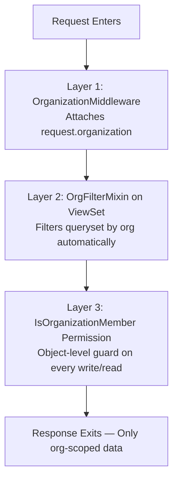
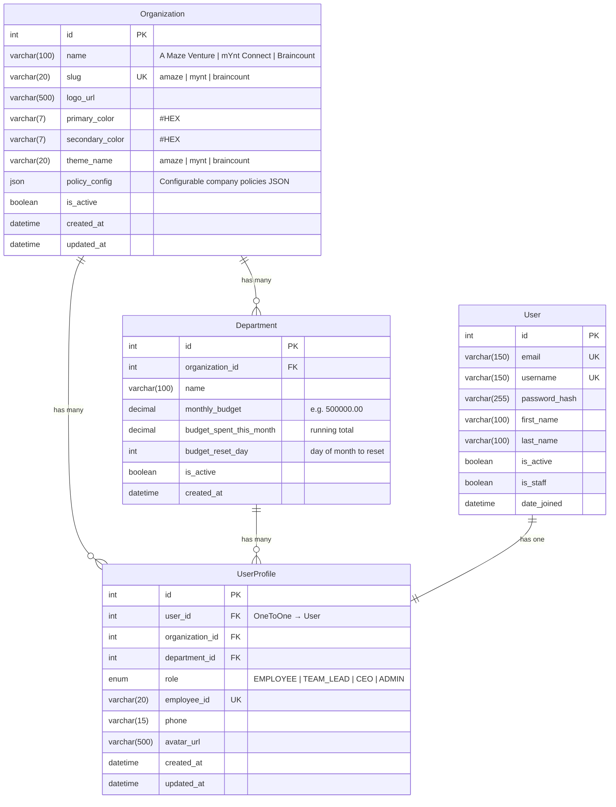
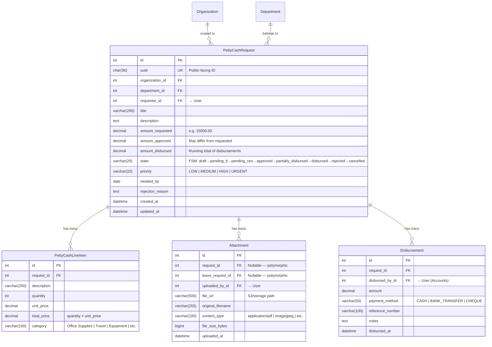
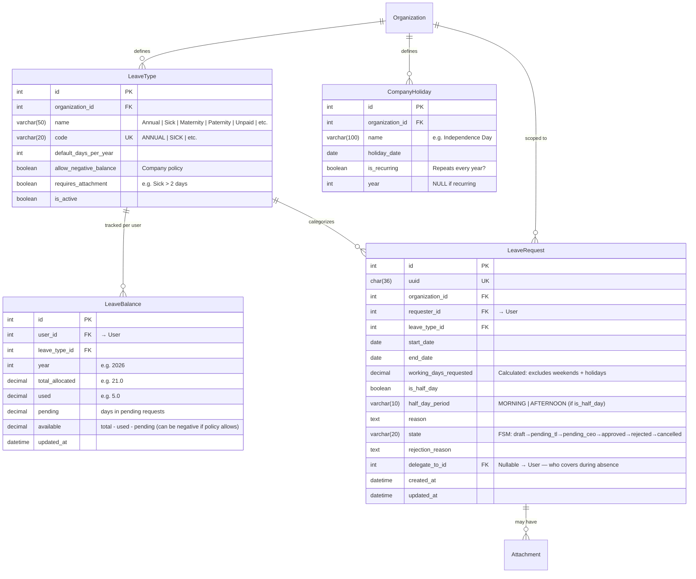
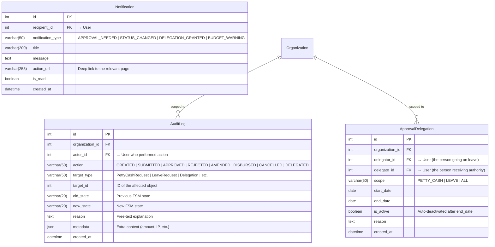
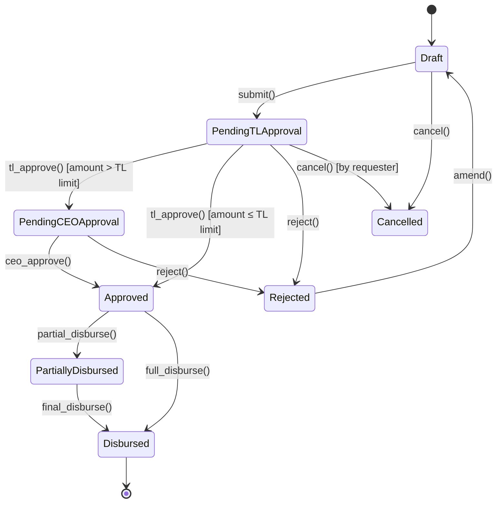
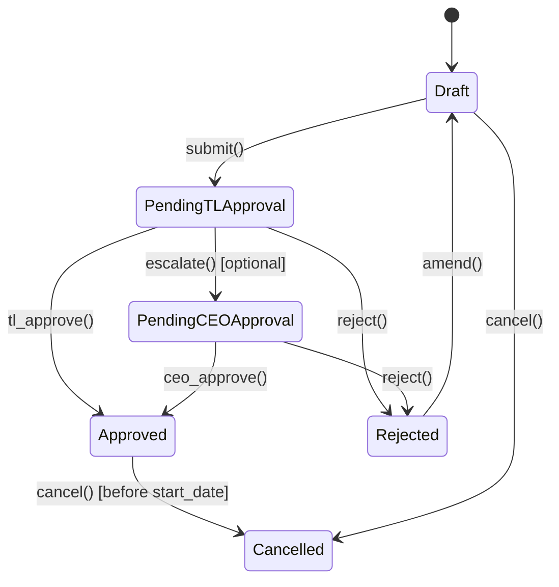

# 🏗️ Operations Management System — Master Blueprint

> **Project:** Internal OMS for A Maze Venture · mYnt Connect · Braincount
> **Stack:** Django REST Framework + MySQL │ React (Vite) + Tailwind v4 + DaisyUI v5 + GSAP
> **Architect revision:** v1.0 — 2026-05-22

---

## Table of Contents

1. [Multi-Tenant Architecture Overview](#1-multi-tenant-architecture-overview)
2. [Complete ERD (Entity-Relationship Diagram)](#2-complete-erd-entity-relationship-diagram)
3. [Recommended Libraries & Packages](#3-recommended-libraries--packages)
4. [Approval Workflow Engine](#4-approval-workflow-engine)
5. [Module Deep-Dives & Edge Cases](#5-module-deep-dives--edge-cases)
6. [Killer Features Architecture](#6-killer-features-architecture)
7. [API Endpoint Matrix](#7-api-endpoint-matrix)
8. [React Frontend Component Tree](#8-react-frontend-component-tree)
9. [Design System & Dynamic Theming](#9-design-system--dynamic-theming)
10. [GSAP Animation Strategy](#10-gsap-animation-strategy)
11. [Real-Time & WebSocket Strategy](#11-real-time--websocket-strategy)
12. [Verification Plan](#12-verification-plan)

---

## 1. Multi-Tenant Architecture Overview

### Why Row-Level Isolation (Not Schema-Based)

`django-tenants` requires **PostgreSQL schemas** — it will not work with MySQL. For MySQL, the proven production pattern is **shared-database, row-level isolation** where every tenant-scoped table carries an `organization_id` foreign key.

### Data Isolation Enforcement — Three Layers



| Layer | What | How |
|-------|------|-----|
| **Middleware** | Attaches `request.organization` on every authenticated request | `OrganizationMiddleware` reads from `request.user.profile.organization` |
| **ViewSet Mixin** | Auto-filters `get_queryset()` + auto-sets org on `perform_create()` | `OrganizationViewSetMixin` applied to every tenant-scoped ViewSet |
| **Permission Class** | Object-level guard that blocks cross-org access | `IsOrganizationMember` checks `obj.organization == request.organization` |

### Global Admin Override

A **Super Admin** role bypasses the org filter. The `OrganizationViewSetMixin` checks `request.user.profile.role == 'ADMIN'` and, if true, returns the unfiltered queryset (or allows filtering by org via a query param `?org=<id>`).

---

## 2. Complete ERD (Entity-Relationship Diagram)

### 2.1 Core / Multi-Tenant Models



> [!IMPORTANT]
> The three organizations (`A Maze Venture`, `mYnt Connect`, `Braincount`) are **seeded via a data migration** — they are not user-created. The `policy_config` JSON field stores company-specific policies like `{"allow_negative_sick_leave": true, "max_carry_forward_days": 5}`.

### 2.2 Petty Cash & Requisition Module



### 2.3 Leave Management Module



### 2.4 Audit & Workflow Models



### 2.5 Full MySQL Table Summary

| # | Table | Tenant-Scoped | Key Relationships |
|---|-------|:---:|---|
| 1 | `organization` | — | Root tenant table |
| 2 | `department` | ✅ | → Organization |
| 3 | `auth_user` (Django built-in) | — | Extended by UserProfile |
| 4 | `user_profile` | ✅ | → User, Organization, Department |
| 5 | `petty_cash_request` | ✅ | → Organization, Department, User |
| 6 | `petty_cash_line_item` | — | → PettyCashRequest |
| 7 | `attachment` | — | → PettyCashRequest or LeaveRequest (polymorphic) |
| 8 | `disbursement` | — | → PettyCashRequest, User |
| 9 | `leave_type` | ✅ | → Organization |
| 10 | `leave_balance` | — | → User, LeaveType |
| 11 | `leave_request` | ✅ | → Organization, User, LeaveType |
| 12 | `company_holiday` | ✅ | → Organization |
| 13 | `audit_log` | ✅ | → Organization, User |
| 14 | `approval_delegation` | ✅ | → Organization, User × 2 |
| 15 | `notification` | — | → User |

---

## 3. Recommended Libraries & Packages

### 3.1 Backend — Python / Django

| Package | Version | Purpose | Why |
|---------|---------|---------|-----|
| `djangorestframework` | 3.15+ | REST API | Core |
| `djangorestframework-simplejwt` | 5.3+ | JWT Auth | Access + Refresh tokens, blacklisting |
| `django-cors-headers` | 4.x | CORS | Required for React frontend on different port |
| `django-filter` | 24.x | Queryset filtering | Integrates with DRF filter backends |
| `django-fsm-2` | 4.2+ | Finite State Machine | Active fork of deprecated `django-fsm`. Declarative approval workflows, prevents invalid transitions |
| `django-fsm-log` | 5.0+ | FSM transition logging | Auto-logs every state change with actor + timestamp |
| `django-auditlog` | 3.4+ | Lightweight change tracking | Field-level change logs, complements `django-simple-history` |
| `django-simple-history` | 3.7+ | Full model audit trail | Snapshots every field change, tracks actor |
| `django-storages` | 1.14+ | Cloud file storage | S3/Azure for receipt uploads (local FS in dev) |
| `django-cleanup` | 9.x | File cleanup | Auto-deletes orphan files on model delete |
| `celery` | 5.4+ | Async tasks | Email notifications, PDF generation, budget resets |
| `django-celery-beat` | 2.7+ | Scheduled tasks | Monthly budget resets, leave balance accrual |
| `redis` / `django-redis` | 5.x | Cache + Broker | Celery broker + response caching |
| `channels` + `channels-redis` | 4.x | WebSockets | Real-time dashboard updates |
| `daphne` | 4.x | ASGI server | Serves Django Channels |
| `mysqlclient` | 2.2+ | MySQL driver | Fastest MySQL driver for Django |
| `django-environ` | 0.11+ | Env management | `.env` file support |
| `drf-spectacular` | 0.28+ | API docs | Auto-generated OpenAPI / Swagger UI |
| `python-holidays` | 0.65+ | Holiday calendar | Country-specific holidays for leave calculations |
| `Pillow` | 11.x | Image processing | Receipt thumbnail generation |
| `whitenoise` | 6.x | Static files | Production static serving |
| `gunicorn` | 22.x | WSGI server | Production server (non-WebSocket routes) |

### 3.2 Frontend — NPM Packages

| Package | Version | Purpose | Why |
|---------|---------|---------|-----|
| `react` + `react-dom` | 19.x | UI framework | Core |
| `vite` | 6.x | Build tool | Lightning-fast HMR |
| `tailwindcss` | 4.x | Utility CSS | CSS-first config in v4 |
| `daisyui` | 5.x | Component library | Themeable, production-ready components |
| `gsap` + `@gsap/react` | 3.12+ | Animations | `useGSAP` hook, premium micro-interactions. **Now 100% free** (acquired by Webflow, 2025) |
| `framer-motion` | 11.x | Declarative animations | Complements GSAP for mount/unmount, layout animations, drag |
| `react-router-dom` | 7.x | Routing | Data loading, nested routes |
| `@tanstack/react-query` | 5.x | Server state | Caching, background refetch, optimistic updates |
| `zustand` | 5.x | Client state | Minimal boilerplate for UI state (theme, sidebar) |
| `react-hook-form` + `zod` | 7.x + 3.x | Forms | Uncontrolled forms + schema validation |
| `@hookform/resolvers` | 3.x | RHF ↔ Zod bridge | Connects Zod schemas to React Hook Form |
| `axios` | 1.x | HTTP client | Interceptors for JWT, request transforms |
| `recharts` | 2.x | Charts | Composable, React-native charting |
| `lucide-react` | latest | Icons | Tree-shakable, 1500+ consistent icons |
| `@react-pdf-viewer/core` | latest | PDF preview | Inline receipt/document viewer |
| `date-fns` | 4.x | Date utils | Tree-shakable, functional API |
| `sonner` | latest | Toasts | Beautiful, modern notifications |
| `clsx` + `tailwind-merge` | latest | Class merging | Clean conditional Tailwind classes |

---

## 4. Approval Workflow Engine

### 4.1 State Machine — Petty Cash



### 4.2 State Machine — Leave Request



### 4.3 Dynamic Routing Logic (Pseudocode)

```python
# In PettyCashRequest model
@transition(field=state, source='draft', target='pending_tl_approval')
def submit(self):
    """Validates budget availability before allowing submission."""
    dept = self.department
    remaining = dept.monthly_budget - dept.budget_spent_this_month
    if self.amount_requested > remaining:
        raise ValidationError(
            f"Request ({self.amount_requested}) exceeds remaining "
            f"department budget ({remaining})."
        )

@transition(field=state, source='pending_tl_approval', target=RETURN_VALUE('approved', 'pending_ceo_approval'))
def tl_approve(self, approved_amount=None):
    """
    TL approves — routes to CEO if amount exceeds TL approval limit,
    otherwise goes directly to Approved.
    """
    self.amount_approved = approved_amount or self.amount_requested
    tl_limit = self.department.tl_approval_limit  # from org config
    if self.amount_approved > tl_limit:
        return 'pending_ceo_approval'  # Escalate
    return 'approved'

# Delegation check — applied via decorator/mixin
def get_effective_approver(request, target_request):
    """Check if the intended approver has delegated authority."""
    delegation = ApprovalDelegation.objects.filter(
        delegator=target_request.get_current_approver(),
        delegate=request.user,
        scope__in=['PETTY_CASH', 'ALL'],
        start_date__lte=date.today(),
        end_date__gte=date.today(),
        is_active=True,
    ).first()
    if delegation:
        return delegation.delegate  # Use delegate as approver
    return None
```

### 4.4 Approval Authority Matrix

| Request Type | Amount Threshold | Routing |
|---|---|---|
| Petty Cash ≤ TL Limit | e.g. ≤ ₱10,000 | Employee → **Team Lead** → Approved |
| Petty Cash > TL Limit | e.g. > ₱10,000 | Employee → Team Lead → **CEO** → Approved |
| Leave (any) | — | Employee → **Team Lead** → Approved |
| Leave (Team Lead's own) | — | Team Lead → **CEO** → Approved |

> [!NOTE]
> The TL approval limit is stored per-department in a `tl_approval_limit` field (add to `Department` model). This allows different thresholds per department per company.

---

## 5. Module Deep-Dives & Edge Cases

### 5.1 Petty Cash — Edge Case Handling

#### EC-1: Request Exceeds Department Monthly Budget

```python
# In PettyCashRequest.submit() transition
remaining = department.monthly_budget - department.budget_spent_this_month
if request.amount_requested > remaining:
    raise ValidationError({
        "amount_requested": f"Exceeds remaining budget of {remaining}. "
                           f"Contact your department head for a budget increase."
    })
```

**Frontend:** The form shows a real-time budget indicator bar (green → yellow → red) that updates as the user types the amount. If the amount exceeds budget, the Submit button is disabled with a tooltip explaining why.

#### EC-2: Partial Disbursement

```python
class Disbursement(models.Model):
    request = models.ForeignKey(PettyCashRequest, related_name='disbursements')
    amount = models.DecimalField(max_digits=12, decimal_places=2)
    # ... other fields

    def save(self, *args, **kwargs):
        super().save(*args, **kwargs)
        # Update running total
        total_disbursed = self.request.disbursements.aggregate(
            total=Sum('amount')
        )['total'] or 0
        self.request.amount_disbursed = total_disbursed
        
        if total_disbursed >= self.request.amount_approved:
            self.request.state = 'disbursed'  # Via FSM transition
        elif total_disbursed > 0:
            self.request.state = 'partially_disbursed'  # Via FSM transition
        
        self.request.save()
```

**UI State:**
- `Approved` → Shows "Disburse" button for Accounts
- `Partially Disbursed` → Shows progress bar: "₱12,000 / ₱15,000 disbursed (80%)" + "Disburse Remaining" button
- `Disbursed` → Locked, shows green checkmark

#### EC-3: Multi-File Receipt Upload

```python
class AttachmentSerializer(serializers.ModelSerializer):
    file = serializers.FileField(write_only=True)
    
    class Meta:
        model = Attachment
        fields = ['id', 'file', 'original_filename', 'content_type', 'file_size_bytes', 'uploaded_at']
        read_only_fields = ['original_filename', 'content_type', 'file_size_bytes', 'uploaded_at']
    
    def validate_file(self, value):
        # Max 10MB per file
        if value.size > 10 * 1024 * 1024:
            raise serializers.ValidationError("File size cannot exceed 10MB.")
        # Allowed types
        allowed_types = ['application/pdf', 'image/jpeg', 'image/png', 'image/webp']
        if value.content_type not in allowed_types:
            raise serializers.ValidationError(f"File type {value.content_type} not allowed.")
        return value

# ViewSet supports batch upload
class AttachmentViewSet(OrganizationViewSetMixin, viewsets.ModelViewSet):
    @action(detail=False, methods=['post'])
    def bulk_upload(self, request):
        files = request.FILES.getlist('files')
        if len(files) > 5:
            return Response({"error": "Maximum 5 files per upload."}, status=400)
        # ... create Attachment for each file
```

### 5.2 Leave Management — Edge Case Handling

#### EC-4: Negative Leave Balance (Company Policy)

```python
# In LeaveRequest.submit() transition
def submit(self):
    balance = LeaveBalance.objects.get(user=self.requester, leave_type=self.leave_type, year=self.start_date.year)
    available = balance.total_allocated - balance.used - balance.pending
    
    if self.working_days_requested > available:
        policy = self.organization.policy_config
        if self.leave_type.code == 'SICK' and policy.get('allow_negative_sick_leave', False):
            # Allow but flag it
            self.metadata = {"negative_balance_warning": True}
        else:
            raise ValidationError(
                f"Insufficient {self.leave_type.name} balance. "
                f"Available: {available} days, Requested: {self.working_days_requested} days."
            )
    
    # Reserve the days
    balance.pending += self.working_days_requested
    balance.available = balance.total_allocated - balance.used - balance.pending
    balance.save()
```

#### EC-5: Overlapping Leave Detection

```python
# Custom validator called during LeaveRequest creation
def check_overlap(user, start_date, end_date, exclude_request_id=None):
    overlapping = LeaveRequest.objects.filter(
        requester=user,
        state__in=['pending_tl_approval', 'pending_ceo_approval', 'approved'],
        start_date__lte=end_date,
        end_date__gte=start_date,
    )
    if exclude_request_id:
        overlapping = overlapping.exclude(id=exclude_request_id)
    
    if overlapping.exists():
        conflicts = overlapping.values_list('start_date', 'end_date', 'state')
        raise ValidationError({
            "dates": f"Overlapping leave found: {list(conflicts)}. "
                     f"Please cancel or modify the existing request first."
        })
```

**Frontend:** A calendar UI (mini-calendar picker) shows existing leaves highlighted in red/amber, preventing the user from selecting overlapping dates visually.

#### EC-6: Weekend/Holiday Exclusion — Working Days Calculation

```python
import holidays
from datetime import timedelta

def calculate_working_days(organization, start_date, end_date):
    """Calculate actual working days, excluding weekends and holidays."""
    # Get country holidays (e.g., Philippines)
    country_holidays = holidays.Philippines(years=start_date.year)
    
    # Get company-specific holidays
    company_holidays = set(
        CompanyHoliday.objects.filter(
            organization=organization,
            holiday_date__range=(start_date, end_date)
        ).values_list('holiday_date', flat=True)
    )
    
    all_holidays = set(country_holidays.keys()) | company_holidays
    
    working_days = 0
    current = start_date
    while current <= end_date:
        if current.weekday() < 5 and current not in all_holidays:  # Mon-Fri, not a holiday
            working_days += 1
        current += timedelta(days=1)
    
    return working_days
```

**API Response:** The create/update endpoint returns `working_days_requested` in the response so the frontend can show "You are requesting **8 working days** (Dec 1-12, excluding 2 weekends + 1 holiday)."

---

## 6. Killer Features Architecture

### 6.1 Executive Analytics Dashboard

**Backend:** A dedicated `AnalyticsViewSet` with aggregation endpoints:

```python
class AnalyticsViewSet(OrganizationViewSetMixin, viewsets.ViewSet):
    permission_classes = [IsAuthenticated, IsCEOOrAdmin]
    
    @action(detail=False, methods=['get'])
    def spending_trends(self, request):
        """Monthly petty cash spending for the last 12 months."""
        org = request.organization
        data = PettyCashRequest.objects.filter(
            organization=org,
            state__in=['disbursed', 'partially_disbursed'],
            created_at__gte=twelve_months_ago
        ).annotate(month=TruncMonth('created_at')).values('month').annotate(
            total_disbursed=Sum('amount_disbursed'),
            request_count=Count('id')
        ).order_by('month')
        return Response(data)
    
    @action(detail=False, methods=['get'])
    def budget_burn_rate(self, request):
        """Per-department budget utilization."""
        departments = Department.objects.filter(organization=request.organization)
        return Response([{
            "department": d.name,
            "budget": d.monthly_budget,
            "spent": d.budget_spent_this_month,
            "utilization_pct": round((d.budget_spent_this_month / d.monthly_budget) * 100, 1)
        } for d in departments])
    
    @action(detail=False, methods=['get'])
    def upcoming_absences(self, request):
        """Employees on leave in the next 30 days."""
        upcoming = LeaveRequest.objects.filter(
            organization=request.organization,
            state='approved',
            start_date__range=(date.today(), date.today() + timedelta(days=30))
        ).select_related('requester__profile', 'leave_type')
        return Response(LeaveAbsenceSerializer(upcoming, many=True).data)
```

**Frontend:** Recharts components in `features/analytics/`:
- `SpendingTrendChart` — Area chart with gradient fill
- `BudgetBurnRateChart` — Horizontal bar chart with red/yellow/green zones
- `AbsenceHeatmap` — Calendar heatmap showing team availability

### 6.2 Smart Receipt Preview

**Architecture:**

```
┌─────────────────────────────────────────────┐
│            Smart Receipt Preview            │
├──────────────────┬──────────────────────────┤
│   Line Items     │     Receipt Viewer       │
│                  │                          │
│  ☐ Printer Ink   │  ┌────────────────────┐  │
│    ₱2,500 × 2    │  │                    │  │
│                  │  │   [PDF / Image      │  │
│  ☐ Bond Paper    │  │    rendered inline] │  │
│    ₱350 × 10     │  │                    │  │
│                  │  │                    │  │
│  ── Total ──     │  └────────────────────┘  │
│  ₱8,500          │  ◄  1/3  ►  [Download]  │
└──────────────────┴──────────────────────────┘
```

- **PDFs:** Use `@react-pdf-viewer/core` to render inline
- **Images:** Native `` with zoom/pan via CSS transforms + GSAP
- **File carousel:** Navigate between multiple attachments with arrow keys
- **No download needed:** Files are served via signed, time-limited URLs from `django-storages`

### 6.3 Manager's Bulk Actions ("Express Approval")

```python
class BulkApprovalViewSet(OrganizationViewSetMixin, viewsets.ViewSet):
    permission_classes = [IsAuthenticated, IsTeamLeadOrAbove]
    
    @action(detail=False, methods=['post'])
    def bulk_approve(self, request):
        """Approve multiple requests in a single API call."""
        request_ids = request.data.get('request_ids', [])
        action = request.data.get('action')  # 'approve' | 'reject'
        reason = request.data.get('reason', '')
        
        results = {"success": [], "failed": []}
        
        for req_id in request_ids:
            try:
                with transaction.atomic():
                    pcr = PettyCashRequest.objects.select_for_update().get(
                        id=req_id, organization=request.organization
                    )
                    if action == 'approve':
                        pcr.tl_approve()  # FSM transition
                    elif action == 'reject':
                        pcr.reject()
                        pcr.rejection_reason = reason
                    pcr.save()
                    results["success"].append(req_id)
            except (TransitionNotAllowed, ValidationError) as e:
                results["failed"].append({"id": req_id, "error": str(e)})
        
        return Response(results)
```

**Frontend UX:**
- Checkbox selection on request list
- Floating action bar appears at bottom: "**3 selected** — [✓ Approve All] [✗ Reject All]"
- GSAP slide-up animation for the action bar
- Confirmation modal with request summary before executing

### 6.4 Out-of-Office (OOO) Delegation

**Flow:**
1. Team Lead/CEO navigates to **Settings → Delegation**
2. Selects a delegate (peer with sufficient role), scope (Petty Cash / Leave / All), and date range
3. System validates no circular delegations and that the delegate has sufficient permissions
4. During the delegation period, the delegate sees forwarded approval items in their queue
5. All actions by the delegate are logged with `acted_as_delegate=True` in the `AuditLog`
6. Auto-deactivation after `end_date` via Celery Beat scheduled task

```python
# Celery Beat task — runs daily
@shared_task
def deactivate_expired_delegations():
    expired = ApprovalDelegation.objects.filter(
        is_active=True,
        end_date__lt=date.today()
    )
    count = expired.update(is_active=False)
    logger.info(f"Deactivated {count} expired delegations.")
```

---

## 7. API Endpoint Matrix

### 7.1 Authentication & User Management

| Method | Endpoint | Auth | Request Body | Response | Notes |
|--------|----------|------|-------------|----------|-------|
| `POST` | `/api/auth/login/` | ❌ | `{"email", "password"}` | `{"access", "refresh", "user": {id, email, role, organization}}` | JWT token pair |
| `POST` | `/api/auth/refresh/` | ❌ | `{"refresh"}` | `{"access"}` | Refresh access token |
| `POST` | `/api/auth/logout/` | ✅ | `{"refresh"}` | `204 No Content` | Blacklists refresh token |
| `GET` | `/api/auth/me/` | ✅ | — | `{user profile with org, dept, role}` | Current user info |
| `PATCH` | `/api/auth/me/` | ✅ | `{phone?, avatar?}` | `{updated profile}` | Update own profile |
| `GET` | `/api/users/` | ✅ Admin | `?org=&dept=&role=` | `[{user profiles}]` | Filterable user list |

### 7.2 Petty Cash Module

| Method | Endpoint | Auth | Role | Request Body | Response |
|--------|----------|------|------|-------------|----------|
| `GET` | `/api/petty-cash/` | ✅ | All | `?state=&priority=&page=&search=` | `{count, next, previous, results: [{request}]}` |
| `POST` | `/api/petty-cash/` | ✅ | All | `{title, description, amount_requested, priority, needed_by, line_items: [{description, qty, unit_price, category}]}` | `{created request}` |
| `GET` | `/api/petty-cash/{uuid}/` | ✅ | Owner/Approver | — | `{full request with line_items, attachments, disbursements, audit_trail}` |
| `PATCH` | `/api/petty-cash/{uuid}/` | ✅ | Owner | `{title?, description?, amount?, line_items?}` | `{updated request}` — Only in `draft` state |
| `POST` | `/api/petty-cash/{uuid}/submit/` | ✅ | Owner | — | `{request with state=pending_tl_approval}` |
| `POST` | `/api/petty-cash/{uuid}/approve/` | ✅ | TL/CEO | `{approved_amount?, comment?}` | `{request with updated state}` |
| `POST` | `/api/petty-cash/{uuid}/reject/` | ✅ | TL/CEO | `{reason}` *(required)* | `{request with state=rejected}` |
| `POST` | `/api/petty-cash/{uuid}/amend/` | ✅ | Owner | — | `{request reset to state=draft}` |
| `POST` | `/api/petty-cash/{uuid}/cancel/` | ✅ | Owner | — | `{request with state=cancelled}` |
| `POST` | `/api/petty-cash/{uuid}/disburse/` | ✅ | Accounts | `{amount, payment_method, reference_number?, notes?}` | `{disbursement record + updated request}` |
| `POST` | `/api/petty-cash/{uuid}/attachments/` | ✅ | Owner | `FormData: files[]` | `[{attachment records}]` |
| `DELETE` | `/api/petty-cash/{uuid}/attachments/{id}/` | ✅ | Owner | — | `204` |
| `POST` | `/api/petty-cash/bulk-action/` | ✅ | TL/CEO | `{request_ids: [], action: "approve"|"reject", reason?}` | `{success: [], failed: []}` |

### 7.3 Leave Module

| Method | Endpoint | Auth | Role | Request Body | Response |
|--------|----------|------|------|-------------|----------|
| `GET` | `/api/leave/types/` | ✅ | All | — | `[{id, name, code, default_days, allow_negative}]` |
| `GET` | `/api/leave/balance/` | ✅ | All | `?year=2026` | `[{leave_type, total, used, pending, available}]` |
| `GET` | `/api/leave/balance/{user_id}/` | ✅ | TL/Admin | `?year=` | Balance for a specific user |
| `GET` | `/api/leave/requests/` | ✅ | All | `?state=&type=&page=` | `{paginated leave requests}` |
| `POST` | `/api/leave/requests/` | ✅ | All | `{leave_type_id, start_date, end_date, is_half_day?, half_day_period?, reason, delegate_to_id?}` | `{created request with calculated working_days}` |
| `GET` | `/api/leave/requests/{uuid}/` | ✅ | Owner/Approver | — | `{full leave request with audit_trail}` |
| `POST` | `/api/leave/requests/{uuid}/submit/` | ✅ | Owner | — | `{state=pending_tl_approval}` |
| `POST` | `/api/leave/requests/{uuid}/approve/` | ✅ | TL/CEO | `{comment?}` | `{state=approved}` |
| `POST` | `/api/leave/requests/{uuid}/reject/` | ✅ | TL/CEO | `{reason}` | `{state=rejected}` |
| `POST` | `/api/leave/requests/{uuid}/cancel/` | ✅ | Owner | — | `{state=cancelled}` — Restores balance |
| `GET` | `/api/leave/holidays/` | ✅ | All | `?year=2026` | `[{company holidays}]` |
| `POST` | `/api/leave/calculate-days/` | ✅ | All | `{start_date, end_date}` | `{working_days, excluded_weekends, excluded_holidays: [{name, date}]}` |
| `GET` | `/api/leave/team-calendar/` | ✅ | TL/CEO | `?month=&year=` | `[{user, leaves}]` — Who's out when |

### 7.4 Analytics & Admin

| Method | Endpoint | Auth | Role | Response |
|--------|----------|------|------|----------|
| `GET` | `/api/analytics/spending-trends/` | ✅ | CEO/Admin | `[{month, total_disbursed, request_count}]` |
| `GET` | `/api/analytics/budget-burn-rate/` | ✅ | CEO/Admin | `[{department, budget, spent, utilization_pct}]` |
| `GET` | `/api/analytics/upcoming-absences/` | ✅ | CEO/Admin | `[{user, leave_type, start_date, end_date}]` |
| `GET` | `/api/analytics/summary/` | ✅ | CEO/Admin | `{total_requests, pending_approvals, monthly_spend, employees_on_leave}` |

### 7.5 Delegation & Notifications

| Method | Endpoint | Auth | Role | Request Body | Response |
|--------|----------|------|------|-------------|----------|
| `GET` | `/api/delegations/` | ✅ | TL/CEO | — | `[{active delegations}]` |
| `POST` | `/api/delegations/` | ✅ | TL/CEO | `{delegate_id, scope, start_date, end_date, reason}` | `{created delegation}` |
| `DELETE` | `/api/delegations/{id}/` | ✅ | Owner | — | `204` — Revoke early |
| `GET` | `/api/notifications/` | ✅ | All | `?is_read=false` | `[{notifications}]` |
| `POST` | `/api/notifications/mark-read/` | ✅ | All | `{notification_ids: []}` | `204` |

---

## 8. React Frontend Component Tree

### 8.1 Full Directory Structure

```
src/
├── app/
│   ├── App.jsx                         # Root component
│   ├── main.jsx                        # Vite entry point
│   ├── router.jsx                      # React Router v7 config
│   └── providers/
│       ├── AppProviders.jsx            # Wraps QueryClient + Auth + Theme
│       ├── AuthProvider.jsx            # JWT context + token refresh
│       └── ThemeProvider.jsx           # Org-based DaisyUI theme switching
│
├── features/
│   ├── auth/
│   │   ├── api/
│   │   │   └── authApi.js              # login, logout, refreshToken, getMe
│   │   ├── components/
│   │   │   ├── LoginForm.jsx           # 🎬 GSAP: form field stagger-in
│   │   │   └── ProtectedRoute.jsx      # Route guard
│   │   ├── hooks/
│   │   │   ├── useAuth.js              # Auth state + actions
│   │   │   └── useLogin.js             # TanStack mutation
│   │   └── stores/
│   │       └── authStore.js            # Zustand: user, tokens, org
│   │
│   ├── dashboard/
│   │   ├── components/
│   │   │   ├── WelcomeHero.jsx         # 🎬 GSAP: greeting text reveal
│   │   │   ├── StatCards.jsx           # 🎬 GSAP: staggered counter animations
│   │   │   ├── QuickActions.jsx        # 🎬 GSAP: hover scale on cards
│   │   │   ├── RecentActivity.jsx      # 🎬 GSAP: staggered list items
│   │   │   └── PendingApprovals.jsx    # Badge with pulse animation
│   │   └── pages/
│   │       └── DashboardPage.jsx       # Main dashboard orchestrator
│   │
│   ├── petty-cash/
│   │   ├── api/
│   │   │   └── pettyCashApi.js         # CRUD, submit, approve, reject, disburse
│   │   ├── components/
│   │   │   ├── RequestForm.jsx         # Multi-step form with budget indicator
│   │   │   ├── RequestList.jsx         # 🎬 GSAP: staggered card entry
│   │   │   ├── RequestDetail.jsx       # Full detail view with timeline
│   │   │   ├── RequestTimeline.jsx     # 🎬 GSAP: timeline node animations
│   │   │   ├── LineItemEditor.jsx      # Dynamic add/remove line items
│   │   │   ├── BudgetIndicator.jsx     # 🎬 GSAP: animated progress bar
│   │   │   ├── DisbursementPanel.jsx   # Partial disbursement tracker
│   │   │   └── ReceiptPreview.jsx      # 🎬 GSAP: slide-in panel
│   │   ├── hooks/
│   │   │   ├── useRequests.js          # TanStack query + filters
│   │   │   ├── useCreateRequest.js     # TanStack mutation + optimistic update
│   │   │   └── useRequestActions.js    # submit, approve, reject mutations
│   │   └── pages/
│   │       ├── PettyCashListPage.jsx   # List + filters
│   │       └── PettyCashDetailPage.jsx # Detail + actions + receipt preview
│   │
│   ├── leave/
│   │   ├── api/
│   │   │   └── leaveApi.js             # CRUD, balance, holidays, calculate-days
│   │   ├── components/
│   │   │   ├── LeaveForm.jsx           # Date picker with overlap warnings
│   │   │   ├── LeaveList.jsx           # 🎬 GSAP: staggered entry
│   │   │   ├── LeaveDetail.jsx         # Full detail with approval timeline
│   │   │   ├── LeaveBalance.jsx        # 🎬 GSAP: animated donut charts
│   │   │   ├── LeaveCalendar.jsx       # Monthly view with team absences
│   │   │   ├── HolidayList.jsx         # Company holidays display
│   │   │   └── WorkingDaysCalc.jsx     # Live calculation display
│   │   ├── hooks/
│   │   │   ├── useLeaveRequests.js
│   │   │   ├── useLeaveBalance.js
│   │   │   └── useLeaveActions.js
│   │   └── pages/
│   │       ├── LeaveListPage.jsx
│   │       ├── LeaveDetailPage.jsx
│   │       └── LeaveCalendarPage.jsx
│   │
│   ├── approvals/
│   │   ├── components/
│   │   │   ├── ApprovalQueue.jsx       # 🎬 GSAP: card stagger + exit animations
│   │   │   ├── ExpressApproval.jsx     # Bulk action mode
│   │   │   ├── BulkActionBar.jsx       # 🎬 GSAP: slide-up from bottom
│   │   │   └── ApprovalCard.jsx        # 🎬 GSAP: swipe-to-approve gesture
│   │   ├── hooks/
│   │   │   ├── usePendingApprovals.js
│   │   │   └── useBulkAction.js
│   │   └── pages/
│   │       └── ApprovalCenterPage.jsx
│   │
│   ├── analytics/
│   │   ├── components/
│   │   │   ├── SpendingTrendChart.jsx  # 🎬 GSAP: chart draw-in animation
│   │   │   ├── BudgetBurnRate.jsx      # Horizontal bar chart
│   │   │   ├── AbsenceCalendar.jsx     # Team availability heatmap
│   │   │   ├── SummaryMetrics.jsx      # 🎬 GSAP: number counter animation
│   │   │   └── DepartmentBreakdown.jsx # Pie/donut chart
│   │   └── pages/
│   │       └── AnalyticsDashboardPage.jsx
│   │
│   ├── delegation/
│   │   ├── components/
│   │   │   ├── DelegationForm.jsx      # Create/edit delegation
│   │   │   └── ActiveDelegations.jsx   # List with status badges
│   │   ├── hooks/
│   │   │   └── useDelegation.js
│   │   └── pages/
│   │       └── DelegationPage.jsx
│   │
│   └── notifications/
│       ├── components/
│       │   ├── NotificationBell.jsx    # 🎬 GSAP: shake animation on new
│       │   ├── NotificationDropdown.jsx # 🎬 GSAP: slide-down + stagger
│       │   └── NotificationItem.jsx
│       └── hooks/
│           └── useNotifications.js     # WebSocket subscription
│
├── shared/
│   ├── components/
│   │   ├── layout/
│   │   │   ├── AppLayout.jsx           # Sidebar + Header + Content area
│   │   │   ├── Sidebar.jsx             # 🎬 GSAP: hover expand, active indicator slide
│   │   │   ├── Header.jsx              # Org logo, user menu, notification bell
│   │   │   └── MobileNav.jsx           # 🎬 GSAP: slide-in drawer
│   │   ├── ui/
│   │   │   ├── StatusBadge.jsx         # Color-coded status pills
│   │   │   ├── DataTable.jsx           # Sortable, filterable table
│   │   │   ├── EmptyState.jsx          # 🎬 GSAP: fade-in illustration
│   │   │   ├── LoadingSkeleton.jsx     # Shimmer loading states
│   │   │   ├── ConfirmModal.jsx        # 🎬 GSAP: scale-in modal
│   │   │   ├── FileUploader.jsx        # Drag-and-drop with progress
│   │   │   ├── SearchInput.jsx         # Debounced search
│   │   │   └── PageTransition.jsx      # 🎬 GSAP: route transition wrapper
│   │   └── feedback/
│   │       ├── Toast.jsx               # Sonner wrapper
│   │       └── ErrorBoundary.jsx       # Graceful error display
│   │
│   ├── hooks/
│   │   ├── useGSAPStagger.js           # Reusable stagger animation hook
│   │   ├── useGSAPPageTransition.js    # Route transition animation hook
│   │   ├── useGSAPCounter.js           # Number counting animation hook
│   │   ├── useDebounce.js
│   │   ├── useMediaQuery.js
│   │   └── useWebSocket.js             # WebSocket connection manager
│   │
│   ├── lib/
│   │   ├── axios.js                    # Axios instance with JWT interceptor
│   │   ├── dateUtils.js                # date-fns wrappers
│   │   ├── formatUtils.js              # Currency, number, date formatting
│   │   └── roleUtils.js               # Permission checks (canApprove, canDisburse, etc.)
│   │
│   └── constants/
│       ├── apiEndpoints.js             # All API URL constants
│       ├── roles.js                    # Role enum + hierarchy
│       └── states.js                   # Request state enum + labels + colors
│
└── assets/
    ├── logos/
    │   ├── amaze-logo.svg
    │   ├── mynt-logo.svg
    │   └── braincount-logo.svg
    └── fonts/                          # If self-hosting
```

### 8.2 Route Map

```javascript
// router.jsx
const router = createBrowserRouter([
  {
    path: '/login',
    element: <LoginPage />,
  },
  {
    path: '/',
    element: <ProtectedRoute><AppLayout /></ProtectedRoute>,
    children: [
      { index: true,           element: <DashboardPage /> },
      { path: 'petty-cash',    element: <PettyCashListPage /> },
      { path: 'petty-cash/:uuid', element: <PettyCashDetailPage /> },
      { path: 'leave',         element: <LeaveListPage /> },
      { path: 'leave/:uuid',   element: <LeaveDetailPage /> },
      { path: 'leave/calendar', element: <LeaveCalendarPage /> },
      { path: 'approvals',     element: <ApprovalCenterPage /> },
      { path: 'analytics',     element: <AnalyticsDashboardPage /> },  // CEO/Admin only
      { path: 'delegation',    element: <DelegationPage /> },          // TL/CEO only
      { path: 'settings',      element: <SettingsPage /> },
    ],
  },
]);
```

---

## 9. Design System & Dynamic Theming

### 9.1 DaisyUI Dynamic Theme per Organization

**Three custom themes defined in CSS:**

```css
/* index.css */
@import "tailwindcss";
@plugin "daisyui" {
  themes: amaze --default, mynt, braincount;
}

/* Theme: A Maze Venture — Deep Indigo / Electric Violet */
[data-theme="amaze"] {
  --color-primary: oklch(55% 0.25 270);       /* Deep Indigo */
  --color-primary-content: oklch(98% 0 0);
  --color-secondary: oklch(65% 0.28 310);     /* Electric Violet */
  --color-accent: oklch(75% 0.2 190);         /* Cyan accent */
  --color-base-100: oklch(16% 0.02 270);      /* Dark bg */
  --color-base-200: oklch(20% 0.02 270);
  --color-base-300: oklch(25% 0.03 270);
  --color-base-content: oklch(92% 0.01 270);
  --color-success: oklch(72% 0.2 150);
  --color-warning: oklch(80% 0.18 85);
  --color-error: oklch(65% 0.25 25);
  --color-info: oklch(70% 0.15 230);
  --rounded-btn: 0.75rem;
  --rounded-box: 1rem;
}

/* Theme: mYnt Connect — Emerald / Mint */
[data-theme="mynt"] {
  --color-primary: oklch(60% 0.22 160);       /* Rich Emerald */
  --color-primary-content: oklch(98% 0 0);
  --color-secondary: oklch(70% 0.18 175);     /* Mint */
  --color-accent: oklch(75% 0.15 75);         /* Gold accent */
  --color-base-100: oklch(15% 0.015 160);
  --color-base-200: oklch(19% 0.015 160);
  --color-base-300: oklch(24% 0.02 160);
  --color-base-content: oklch(92% 0.01 160);
  --color-success: oklch(72% 0.2 150);
  --color-warning: oklch(80% 0.18 85);
  --color-error: oklch(65% 0.25 25);
  --color-info: oklch(70% 0.15 230);
  --rounded-btn: 0.5rem;
  --rounded-box: 0.75rem;
}

/* Theme: Braincount — Warm Amber / Burnt Orange */
[data-theme="braincount"] {
  --color-primary: oklch(65% 0.2 50);         /* Warm Amber */
  --color-primary-content: oklch(15% 0.02 50);
  --color-secondary: oklch(60% 0.22 30);      /* Burnt Orange */
  --color-accent: oklch(70% 0.15 280);        /* Lavender accent */
  --color-base-100: oklch(16% 0.015 50);
  --color-base-200: oklch(20% 0.015 50);
  --color-base-300: oklch(25% 0.02 50);
  --color-base-content: oklch(92% 0.01 50);
  --color-success: oklch(72% 0.2 150);
  --color-warning: oklch(80% 0.18 85);
  --color-error: oklch(65% 0.25 25);
  --color-info: oklch(70% 0.15 230);
  --rounded-btn: 1rem;
  --rounded-box: 1.25rem;
}
```

**Theme Switching in React:**

```jsx
// ThemeProvider.jsx
import { useEffect } from 'react';
import { useAuthStore } from '@/features/auth/stores/authStore';

const ORG_THEMES = {
  amaze: { theme: 'amaze', logo: '/logos/amaze-logo.svg', name: 'A Maze Venture' },
  mynt:  { theme: 'mynt',  logo: '/logos/mynt-logo.svg',  name: 'mYnt Connect' },
  braincount: { theme: 'braincount', logo: '/logos/braincount-logo.svg', name: 'Braincount' },
};

export function ThemeProvider({ children }) {
  const orgSlug = useAuthStore(s => s.user?.organization?.slug);
  
  useEffect(() => {
    const config = ORG_THEMES[orgSlug] || ORG_THEMES.amaze;
    document.documentElement.setAttribute('data-theme', config.theme);
  }, [orgSlug]);
  
  return children;
}
```

### 9.2 Typography

```css
/* Google Fonts: Inter (body) + Outfit (headings) */
@import url('https://fonts.googleapis.com/css2?family=Inter:wght@300;400;500;600;700&family=Outfit:wght@500;600;700;800&display=swap');

:root {
  --font-body: 'Inter', system-ui, sans-serif;
  --font-heading: 'Outfit', system-ui, sans-serif;
}

body {
  font-family: var(--font-body);
}

h1, h2, h3, h4, h5, h6 {
  font-family: var(--font-heading);
}
```

### 9.3 Layout Architecture

```
┌──────────────────────────────────────────────────────────────┐
│  Header Bar                                    🔔  👤 Name  │
│  [Org Logo]  [Search...]                     Notifications  │
├──────────┬───────────────────────────────────────────────────┤
│          │                                                   │
│ Sidebar  │              Main Content Area                    │
│          │                                                   │
│ 📊 Dash  │  ┌─────────┬─────────┬─────────┬────────┐       │
│ 💰 Petty │  │ Stat    │ Stat    │ Stat    │ Stat   │       │
│ 🏖️ Leave │  │ Card 1  │ Card 2  │ Card 3  │ Card 4 │       │
│ ✅ Apprvl│  └─────────┴─────────┴─────────┴────────┘       │
│ 📈 Stats │                                                   │
│ 🔄 Deleg │  ┌──────────────────────────────────────┐        │
│          │  │         Data Table / Cards            │        │
│ ──────── │  │                                      │        │
│ ⚙️ Sett  │  │                                      │        │
│          │  └──────────────────────────────────────┘        │
│          │                                                   │
└──────────┴───────────────────────────────────────────────────┘
```

- **Sidebar:** Collapsed (icons only) on medium screens, full on large, drawer on mobile
- **Glass-morphism panels:** `backdrop-blur-xl bg-base-200/60 border border-base-content/5`
- **Subtle gradient overlays** on stat cards using org-specific primary colors

---

## 10. GSAP Animation Strategy

### 10.1 Reusable GSAP Hooks

#### `useGSAPStagger` — Staggered List Entry

```jsx
// shared/hooks/useGSAPStagger.js
import { useRef } from 'react';
import { useGSAP } from '@gsap/react';
import gsap from 'gsap';

export function useGSAPStagger(selector, deps = [], options = {}) {
  const containerRef = useRef(null);
  const {
    y = 24,
    opacity = 0,
    stagger = 0.06,
    duration = 0.45,
    ease = 'power3.out',
    delay = 0,
  } = options;

  useGSAP(() => {
    const elements = containerRef.current?.querySelectorAll(selector);
    if (!elements?.length) return;

    gsap.fromTo(elements,
      { y, opacity, filter: 'blur(4px)' },
      { y: 0, opacity: 1, filter: 'blur(0px)', stagger, duration, ease, delay }
    );
  }, { scope: containerRef, dependencies: deps });

  return containerRef;
}

// Usage in RequestList.jsx
function RequestList({ requests }) {
  const listRef = useGSAPStagger('.request-card', [requests]);
  
  return (
    <div ref={listRef}>
      {requests.map(req => (
        <div key={req.id} className="request-card">...</div>
      ))}
    </div>
  );
}
```

#### `useGSAPCounter` — Animated Number Counter

```jsx
// shared/hooks/useGSAPCounter.js
import { useRef } from 'react';
import { useGSAP } from '@gsap/react';
import gsap from 'gsap';

export function useGSAPCounter(targetValue, deps = [], options = {}) {
  const elementRef = useRef(null);
  const { duration = 1.2, ease = 'power2.out', prefix = '', suffix = '' } = options;

  useGSAP(() => {
    const obj = { val: 0 };
    gsap.to(obj, {
      val: targetValue,
      duration,
      ease,
      onUpdate: () => {
        if (elementRef.current) {
          elementRef.current.textContent = `${prefix}${Math.round(obj.val).toLocaleString()}${suffix}`;
        }
      },
    });
  }, { dependencies: [targetValue, ...deps] });

  return elementRef;
}

// Usage in StatCards.jsx
function StatCard({ label, value }) {
  const counterRef = useGSAPCounter(value, [], { prefix: '₱', duration: 1.5 });
  return (
    <div className="stat-card">
      <span className="text-sm text-base-content/60">{label}</span>
      <span ref={counterRef} className="text-3xl font-bold text-primary">0</span>
    </div>
  );
}
```

### 10.2 Premium Hover States for Action Buttons

```jsx
// ApproveButton.jsx
import { useRef } from 'react';
import gsap from 'gsap';

function ApproveButton({ onClick, disabled, loading }) {
  const btnRef = useRef(null);
  const shineRef = useRef(null);

  const handleMouseEnter = () => {
    if (disabled) return;
    gsap.to(btnRef.current, {
      scale: 1.04,
      boxShadow: '0 8px 30px oklch(72% 0.2 150 / 0.3)',
      duration: 0.25,
      ease: 'power2.out',
    });
    // Shine sweep effect
    gsap.fromTo(shineRef.current,
      { x: '-100%', opacity: 0.4 },
      { x: '200%', opacity: 0, duration: 0.6, ease: 'power2.inOut' }
    );
  };

  const handleMouseLeave = () => {
    gsap.to(btnRef.current, {
      scale: 1,
      boxShadow: '0 2px 8px oklch(0% 0 0 / 0.1)',
      duration: 0.3,
      ease: 'power2.inOut',
    });
  };

  const handleClick = () => {
    gsap.timeline()
      .to(btnRef.current, { scale: 0.95, duration: 0.1 })
      .to(btnRef.current, { scale: 1, duration: 0.2, ease: 'back.out(2)' });
    onClick?.();
  };

  return (
    <button
      ref={btnRef}
      className="btn btn-success relative overflow-hidden"
      onMouseEnter={handleMouseEnter}
      onMouseLeave={handleMouseLeave}
      onClick={handleClick}
      disabled={disabled || loading}
    >
      <span ref={shineRef} className="absolute inset-0 bg-gradient-to-r from-transparent via-white/20 to-transparent pointer-events-none" />
      {loading ? <span className="loading loading-spinner loading-sm" /> : '✓ Approve'}
    </button>
  );
}
```

### 10.3 Tab / Page Transitions

```jsx
// shared/components/ui/PageTransition.jsx
import { useRef } from 'react';
import { useGSAP } from '@gsap/react';
import gsap from 'gsap';
import { useLocation } from 'react-router-dom';

export function PageTransition({ children }) {
  const containerRef = useRef(null);
  const location = useLocation();

  useGSAP(() => {
    gsap.fromTo(containerRef.current,
      { opacity: 0, y: 12, filter: 'blur(6px)' },
      { opacity: 1, y: 0, filter: 'blur(0px)', duration: 0.4, ease: 'power3.out' }
    );
  }, { dependencies: [location.pathname] });

  return <div ref={containerRef}>{children}</div>;
}
```

### 10.4 Liquid Tab Switching

```jsx
// TabPanel with sliding indicator
function TabPanel({ tabs, activeTab, onTabChange }) {
  const indicatorRef = useRef(null);
  const tabsRef = useRef([]);

  useGSAP(() => {
    const activeEl = tabsRef.current[activeTab];
    if (!activeEl || !indicatorRef.current) return;
    
    gsap.to(indicatorRef.current, {
      x: activeEl.offsetLeft,
      width: activeEl.offsetWidth,
      duration: 0.35,
      ease: 'power3.out',
    });
  }, { dependencies: [activeTab] });

  return (
    <div className="relative flex gap-1 p-1 bg-base-200 rounded-xl">
      {/* Sliding indicator */}
      <div
        ref={indicatorRef}
        className="absolute top-1 bottom-1 rounded-lg bg-primary/15 border border-primary/20"
      />
      {tabs.map((tab, i) => (
        <button
          key={tab.id}
          ref={el => tabsRef.current[i] = el}
          className={`relative z-10 px-4 py-2 text-sm font-medium transition-colors ${
            activeTab === i ? 'text-primary' : 'text-base-content/60 hover:text-base-content'
          }`}
          onClick={() => onTabChange(i)}
        >
          {tab.label}
        </button>
      ))}
    </div>
  );
}
```

### 10.5 Defensive UX Patterns

| Pattern | Implementation |
|---------|---------------|
| **Double-submit prevention** | Disable button + show spinner on click. Re-enable on success/error via TanStack Query mutation state `isPending`. |
| **Optimistic UI** | When approving, immediately move the card out (GSAP exit animation) and revert if the API fails. |
| **Confirmation modals** | All destructive actions (reject, cancel, delete) require a modal with the reason field. GSAP scale-in animation. |
| **Unsaved changes guard** | `beforeunload` listener + React Router `useBlocker` when form has dirty fields. |
| **Role-gated visibility** | Buttons/routes are conditionally rendered based on `roleUtils.canApprove(user)`, `canDisburse(user)`, etc. |
| **Empty states** | Beautiful illustrated empty states with a CTA instead of blank screens. |
| **Error recovery** | TanStack Query's `retry` + error boundaries with "Try Again" buttons. |
| **Loading skeletons** | DaisyUI skeleton classes shown during data fetch, not spinners (reduces perceived load time). |

---

## 11. Real-Time & WebSocket Strategy

### Recommended: Django Channels WebSockets

**Why WebSockets over polling:**
- Instant UI updates when a leave/request status changes
- Sub-100ms notification delivery
- Much more efficient than polling every 5-10 seconds

**Architecture:**

```python
# consumers.py
class DashboardConsumer(AsyncWebsocketConsumer):
    async def connect(self):
        user = self.scope['user']
        org_slug = user.profile.organization.slug
        
        # Join org-specific group
        self.org_group = f'org_{org_slug}'
        await self.channel_layer.group_add(self.org_group, self.channel_name)
        
        # Join personal group (for notifications)
        self.user_group = f'user_{user.id}'
        await self.channel_layer.group_add(self.user_group, self.channel_name)
        
        await self.accept()
    
    async def status_update(self, event):
        """Handles request/leave status change broadcasts."""
        await self.send(text_data=json.dumps(event['data']))
```

**Frontend:**

```jsx
// shared/hooks/useWebSocket.js
export function useWebSocket(onMessage) {
  const { accessToken } = useAuthStore();
  
  useEffect(() => {
    const ws = new WebSocket(`ws://localhost:8000/ws/dashboard/?token=${accessToken}`);
    
    ws.onmessage = (event) => {
      const data = JSON.parse(event.data);
      onMessage(data);
      
      // Invalidate relevant TanStack Query caches
      if (data.type === 'REQUEST_STATUS_CHANGED') {
        queryClient.invalidateQueries({ queryKey: ['petty-cash'] });
      }
      if (data.type === 'LEAVE_STATUS_CHANGED') {
        queryClient.invalidateQueries({ queryKey: ['leave'] });
      }
    };
    
    return () => ws.close();
  }, [accessToken]);
}
```

**Fallback:** If WebSockets are too complex for the hackathon timeline, use **TanStack Query's `refetchInterval`** set to 15 seconds for pending approval lists and 60 seconds for dashboard metrics. This is simpler but less responsive.

---

## 12. Verification Plan

### Automated Tests

#### Backend
```bash
# Run Django test suite
python manage.py test --parallel

# Key test areas:
# - Multi-tenant isolation (User A can't see Org B's data)
# - FSM transition validation (invalid transitions raise errors)
# - Leave overlap detection
# - Working days calculation (weekends + holidays excluded)
# - Budget enforcement (over-budget requests blocked)
# - Partial disbursement state tracking
# - Delegation authority forwarding
# - Bulk approval atomicity
```

#### Frontend
```bash
# Run Vite + Vitest
npm run test

# Key test areas:
# - Theme switching renders correct colors
# - Protected routes redirect unauthenticated users
# - Form validation displays correct error messages
# - Bulk action bar appears when items selected
# - GSAP animations don't crash on fast navigation
```

### Manual Verification
- Login as users from each of the 3 organizations and verify data isolation
- Submit a petty cash request exceeding the department budget (expect error)
- Test partial disbursement flow end-to-end
- Create overlapping leave requests (expect warning)
- Test OOO delegation: delegate authority, then approve as delegate
- Verify theme changes (colors, logos) per organization
- Test bulk approve/reject with mixed valid/invalid requests
- Verify WebSocket updates in real-time across two browser tabs

### Browser Testing
- Responsive layout on 1440px, 1024px, 768px, 375px viewports
- GSAP animations at 60fps (Chrome DevTools Performance tab)
- Lighthouse audit: aim for 90+ Performance, 100 Accessibility

---

## Resolved Decisions

| # | Question | Decision |
|---|----------|----------|
| **Q1** | Currency & Locale | **BDT (৳)** — Single currency, Bangladeshi Taka |
| **Q2** | Authentication Method | **Email + Password only** — No SSO/OAuth |
| **Q3** | File Storage | **Cloud in SQL** — Store files in the database / cloud SQL |
| **Q4** | Email Notifications | **Both** — Email (Celery + SMTP) AND in-app web notifications |
| **Q5** | Seed Data | **Yes** — Comprehensive seed script with demo data for all 3 orgs |
